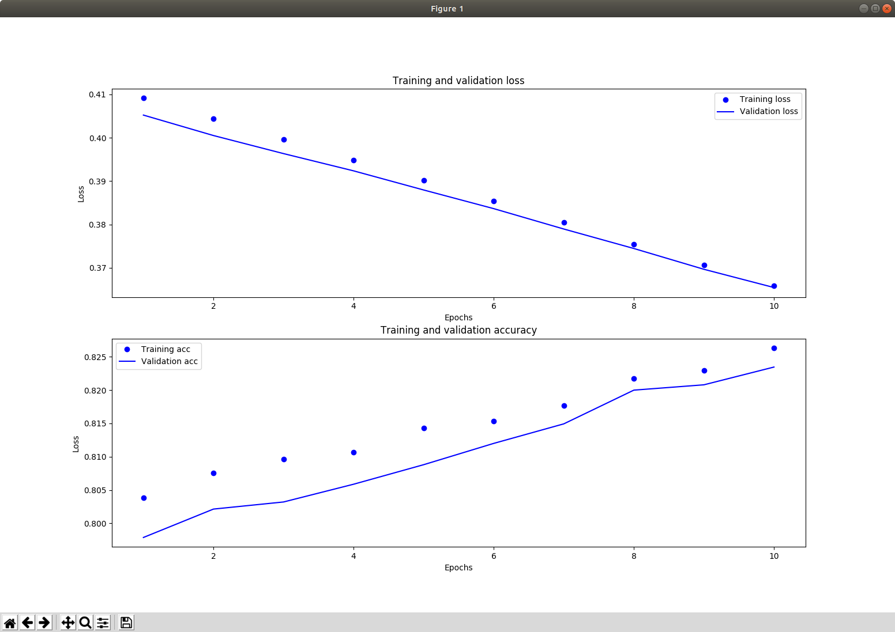

[SITE](https://medium.com/ensina-ai/introdu%C3%A7%C3%A3o-a-classificadores-bin%C3%A1rios-usando-keras-3dac9e2a3c6d)

# Keras classifier on the [Pima Indians Dataset](https://www.kaggle.com/uciml/pima-indians-diabetes-database)

Neural network for diabetes disease classification.

## Training the classifier

```
python keras_classifier.py --graph
```
Model is saved as .h5 file in the current folder

--graph option shows metric graphs at each K-Fold step (default 4)



## Predict

An REST api is provided

``` 
FLASK_APP=diabetes_web.py flask run
```


